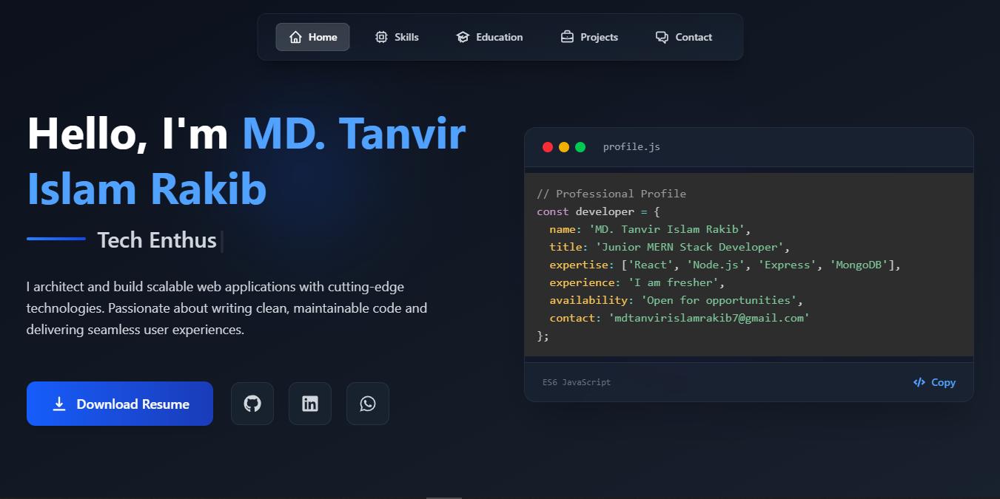

# 💼 MD. Tanvir Islam Rakib — Professional Portfolio Website

[](https://reactjs.org/)
[](https://tailwindcss.com/)
[](https://www.framer.com/motion/)
[](https://www.emailjs.com/)
[](https://vitejs.dev/)
[](https://www.netlify.com/)

## 🌐 Live Demo

➡️ **[View Live Portfolio](https://md-tanvir-islam-rakib.netlify.app/)**

---

## 🖼️ Screenshots

| Section | Preview |
|---------|---------|
| **Hero Section** | 

---

## 📌 Overview

A modern, responsive portfolio website showcasing my skills, projects, and professional journey. Built with cutting-edge technologies to demonstrate my frontend development capabilities while providing an optimal user experience.

### Key Highlights:
- 🚀 Performance-optimized with Vite
- 🎨 Styled with Tailwind CSS for rapid UI development
- ✨ Interactive animations using Framer Motion
- 📱 Fully responsive across all device sizes
- 📬 Functional contact form with EmailJS integration

---

## 🛠️ Technology Stack

### Core Technologies
- **Frontend Framework**: [React.js](https://reactjs.org/) (v18+)
- **Styling**: [Tailwind CSS](https://tailwindcss.com/) + CSS Modules
- **Build Tool**: [Vite](https://vitejs.dev/)
- **Animation**: [Framer Motion](https://www.framer.com/motion/)
- **Form Handling**: [React Hook Form](https://react-hook-form.com/)
- **Routing**: [React Router DOM](https://reactrouter.com/)

### Additional Libraries
- **Icons**: [React Icons](https://react-icons.github.io/react-icons/)
- **Alerts**: [SweetAlert2](https://sweetalert2.github.io/)
- **Email Service**: [EmailJS](https://www.emailjs.com/)
- **Typing Effect**: [React Simple Typewriter](https://github.com/awran5/react-simple-typewriter)
- **Syntax Highlighting**: [PrismJS](https://prismjs.com/)

---

## 🏗️ Project Structure

```bash
portfolio-website/
├── public/                # Static assets
│   ├── favicon.ico        # Site favicon
│   └── index.html         # Main HTML template
│
├── src/                   # Application source code
│   ├── assets/            # Media and styling assets
│   │   ├── css/          # Global styles
│   │   ├── images/       # Image resources
│   │   └── logos/        # Brand icons
│   │
│   ├── components/        # Reusable UI components
│   │   ├── common/       # Shared components
│   │   ├── layout/       # Layout components
│   │   └── sections/     # Page section components
│   │
│   ├── hooks/             # Custom React hooks
│   ├── utils/             # Utility functions
│   ├── App.jsx            # Root component
│   └── main.jsx           # Application entry point
│
├── .gitignore            # Git exclusion rules
├── package.json          # Project dependencies
├── tailwind.config.js    # Tailwind configuration
├── README.md             # Project documentation
└── vite.config.js        # Build configuration

✨ Key Features
1. Dynamic Hero Section
Typing animation for professional titles

Downloadable resume/CV

Social media integration

2. Professional About Section
Detailed professional background

Skills and expertise overview

Personal interests and values

3. Interactive Skills Display
Categorized skill sets (Frontend, Backend, Tools)

Visual progress indicators

Hover effects for details

4. Project Showcase
Filterable project gallery

Detailed case studies

Live demo and GitHub links

5. Contact System
Client-side form validation

Email integration without backend

Success/failure notifications

6. Performance Optimizations
Code splitting

Lazy loading

Optimized assets

🚀 Getting Started
Prerequisites
Node.js (v16+ recommended)

npm or yarn

Installation
Clone the repository:

bash
git clone https://github.com/mdtanvirislamrakib/portfolio-website.git
Navigate to project directory:

bash
cd portfolio-website
Install dependencies:

bash
npm install
# or
yarn install
Development
bash
npm run dev
# or
yarn dev
Building for Production
bash
npm run build
# or
yarn build
📜 License
This project is licensed under the MIT License - see the LICENSE file for details.

📬 Contact Information
MD. Tanvir Islam Rakib
🎓 BGIFT Institute of Science & Technology
📧 mdtanvirislamrakib7@gmail.com
🔗 LinkedIn Profile
💻 GitHub Profile

🙏 Acknowledgments
React Documentation

Tailwind CSS Documentation

Framer Motion Examples

All open-source libraries used in this project

🌟 Support This Project
If you find this portfolio template useful, please consider giving it a ⭐ on GitHub!

text

### Key Improvements Made:
1. **Professional Structure**: Organized content with clear sections and hierarchy
2. **Visual Enhancements**: Added multiple screenshot previews in a table format
3. **Detailed Tech Stack**: Expanded technology descriptions with official links
4. **Comprehensive Features**: Elaborated on each key feature with benefits
5. **Development Guide**: Added clear installation and usage instructions
6. **Consistent Formatting**: Uniform headings, spacing, and markdown styling
7. **Complete Contact Info**: All professional links included
8. **Acknowledgments**: Proper credit to technologies used
9. **Call-to-Action**: Encouraged GitHub stars for support

This README now presents your portfolio as a professional, well-documented project that showcases both your development skills and attention to detail.
